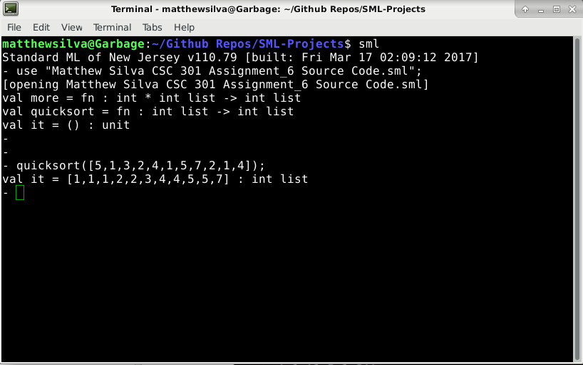
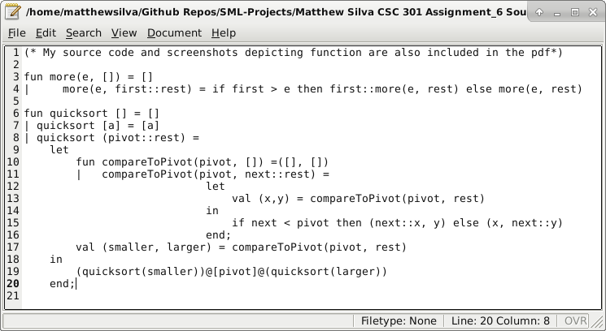
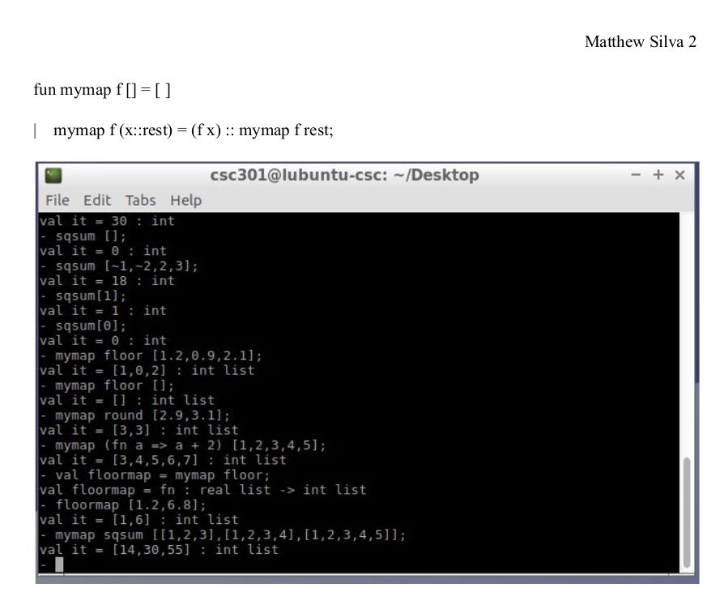

# SML-Projects

The above is an implementation of quicksort in SML

Dependencies/Installation:

	Install the SML implementation of your choice (SML of NJ installation shown below)

	sudo apt-get install smlnj
	
Running Code in Interpreter:

Start the Interpreter:
	
	sml
	
	
	
Load the Code:
	
	use "<filename>";
	
	e.g.
	
	use "Matthew Silva CSC 301 Assignment_7 Source Code.sml";
	
	
Run the Code:
	
See the corresponding PDF for examples
	

	
	The screenshot above shows an example of mymap from Assignment_7.
	
	The mymap function is my own implementation of the map function, similar
	to the map function seen in Python.